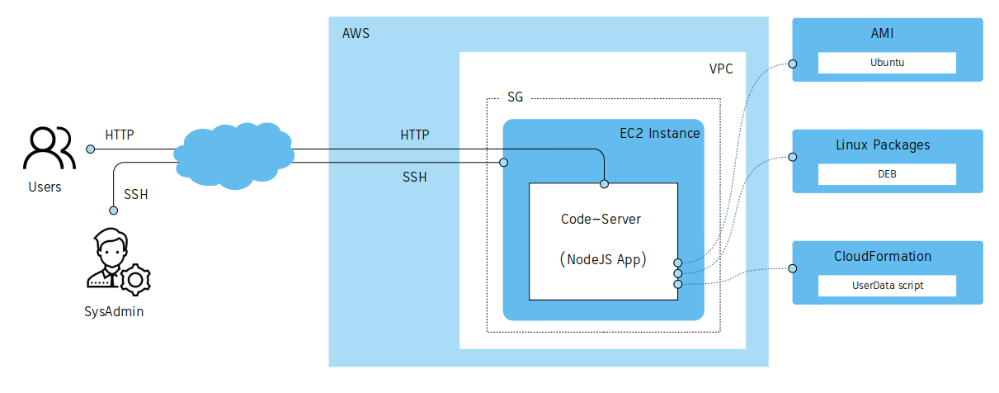
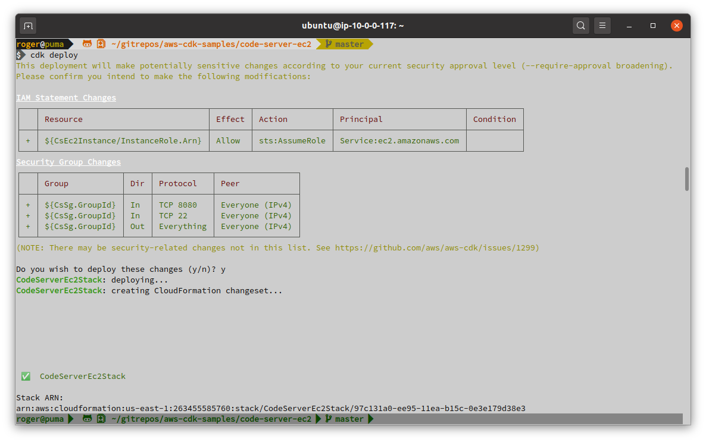
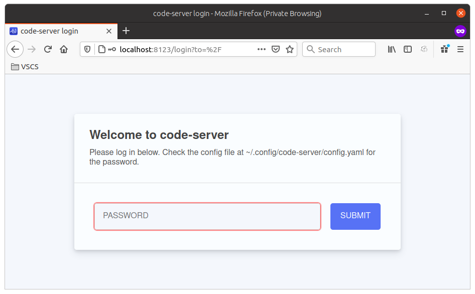
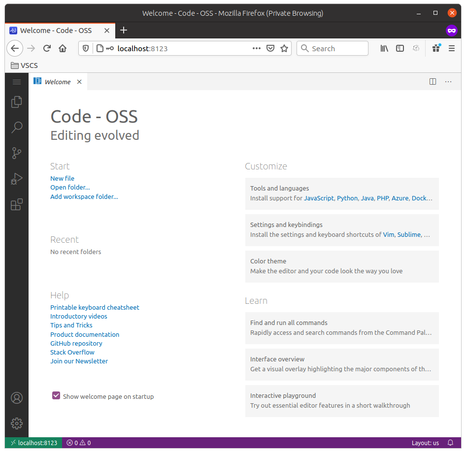
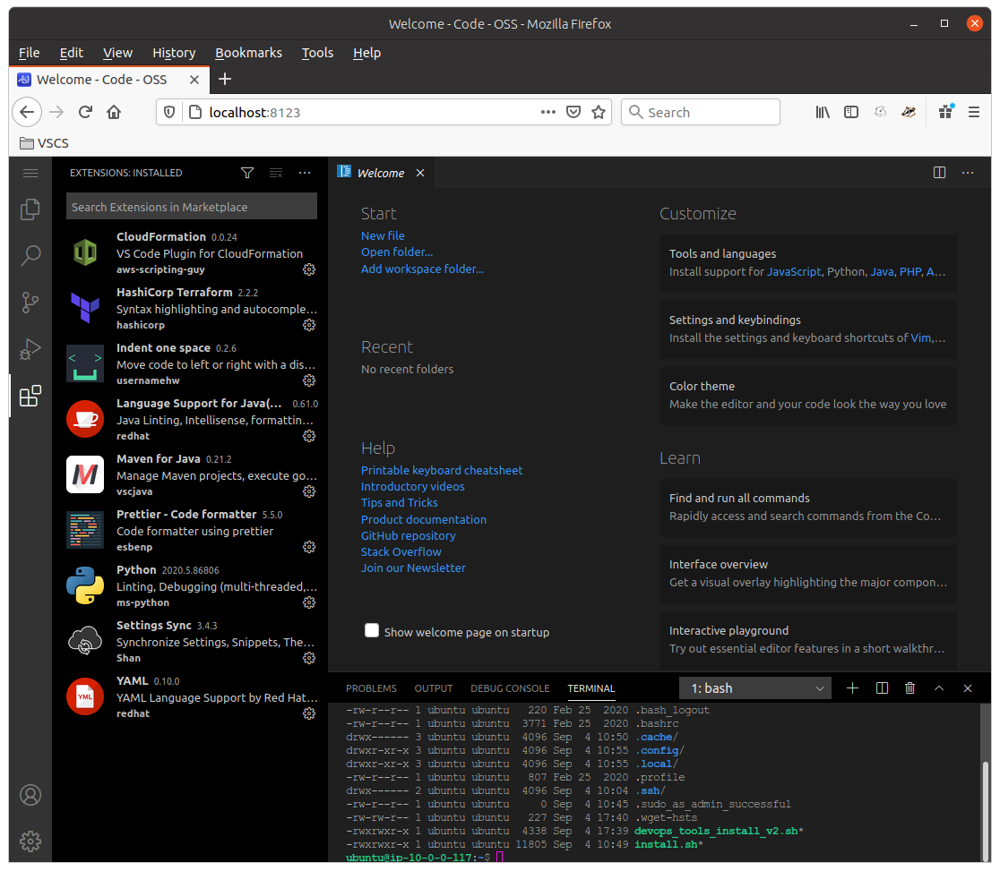

# Code-Server (VS Code) in an EC2 Instance, Ubuntu AMI and custom userData

> The Code-Server is a Cloud IDE based on VS Code.
> The Code-Server is a NodeJS Application and the idea is creating an EC2 instance based on official Ubuntu AMI and install Code-Server and all its dependencies through the `cloud_devops_tools.sh` script (an `userData` script passed to CloudFormation for its installation).



## Steps

### 1. Initialize the project

```sh
$ git clone https://github.com/chilcano/aws-cdk-samples
$ cd aws-cdk-samples/code-server-ec2
$ nmp install
```

### 2. Deploy the project

If you want to review the CloudFormation code, execute this command:
```sh
$ cdk synth
```

#### Using the Ubuntu AMI

In `lib/code-server-ec2-stack.ts` you have to define a `AMI Map` with the AMI ID for each AWS Region.
```typescript
[...]
    // https://cloud-images.ubuntu.com/locator/ec2/
    // owner: 099720109477 (ubuntu) 
    const imgLinuxUbu = new ec2.GenericLinuxImage({  
      'us-east-1': 'ami-05cf2c352da0bfb2e',
      'us-east-2': 'ami-0e45766c39d6d6e73',
      'us-west-1': 'ami-0b10e1018d4058364',
      'us-west-2': 'ami-0ba8629bff503c084'
    });
[...]
```
And in `bin/code-server-ec2.ts` pickup the AWS Region from SO Environment.
```typescript
#!/usr/bin/env node
import 'source-map-support/register';
import * as cdk from '@aws-cdk/core';

import { CodeServerEc2Stack } from '../lib/code-server-ec2-stack';

const app = new cdk.App();
new CodeServerEc2Stack(app, 'CodeServerEc2Stack', { 
    env: {
        region: process.env.AWS_DEFAULT_REGION,
    },
});
```

Finally, make sure to set up the `AWS_DEFAULT_REGION` that you want to use, for example, in my case is:
```sh
$ export AWS_DEFAULT_REGION="us-east-1"
```  

#### Loading the custom userData script

To install or provision applications, its dependencies and other packages I use the `_assets/scripts/cloud_devops_tools.sh` bash script. You could use your own based on Ansible or Chef. Since all AWS AMIs embeds [Cloud-Init](https://cloud-init.io), installing Ansible or Chef runtimes aren't needed, because Cloud-Init allows initialize your fresh SO instance and allows the installation and configuration of new software on it.
To load the bash script, just update your stack editing `lib/code-server-ec2-stack.ts`.
```typescript
[...]
    const userData = readFileSync('custom_assets/scripts/install_tools.sh', 'utf-8');
    instance.addUserData( userData );
    instance.instance.addPropertyOverride('KeyName', 'chilcan0');
[...]
```

#### Deploying the IaC
 ```sh
$ cdk deploy
```



### 3. Calling the Code-Server

If `cdk deploy` went successfully you will get by default a web application (Code-Server) running on `127.0.0.1:8080` which is unreachable from Internet but accessible only from itself EC2 instance. Since we have opened 2 ports (8080/HTTP and 22/SSH) in the SecurityGroup, we will create a SSH tunnel to the `8080/HTTP` port to simulate I'm connected locally to the EC2 instance.

From your AWS Web Console, get the `Public DNS (IPv4)` or `IPv4 Public IP` about the EC2 instance created, with that information connect to the host through SSH and get the Code-Server's password that generates by default:
```sh
$ ssh ubuntu@ec2-54-227-165-113.compute-1.amazonaws.com -i ~/Downloads/chilcan0.pem 

ubuntu@ip-10-0-0-117:~$ cat .config/code-server/config.yaml 
bind-addr: 127.0.0.1:8080
auth: password
password: 5995b51c25c621190abd55e8
cert: false
``` 

Now, create the SSH tunnel:
```sh
$ ssh -nNT -L 8123:localhost:8080 ubuntu@ec2-54-227-165-113.compute-1.amazonaws.com -i ~/Downloads/chilcan0.pem
```  

Finally, open the URL [http://localhost:8123](http://localhost:8123) in your browser, you should see this:  
 


### 4. Configuring the Code-Server

The `_assets/scripts/cloud_devops_tools.sh` bash scripts I've used as `userData` installs Code-Server and only the [Settings-Sync](https://marketplace.visualstudio.com/items?itemName=Shan.code-settings-sync) extension that will allow restore a previous Code-Server or VS Code settings, even other extensions. For that you need a Gist ID that your previous Code-Server or VS Code has generated. If you don't have one, you can use mine.

> Settings-Sync Gist ID: b5f88127bd2d89289dc2cd36032ce856   
> Gist URL: [https://gist.github.com/chilcano/b5f88127bd2d89289dc2cd36032ce856](https://gist.github.com/chilcano/b5f88127bd2d89289dc2cd36032ce856)   


Once restored all Code-Server settings, you will see this:




### 5. Cleaning up

```sh
$ cdk destroy
``` 

## References

1. [Building an affordable remote DevOps desktop on AWS | Apr 9, 2020](https://holisticsecurity.io/2020/04/09/building-an-affordable-remote-devops-desktop-on-aws)
2. [A Cloud IDE for the masses | Aug 5, 2020 ](https://holisticsecurity.io/2020/08/05/a-cloud-ide-for-the-masses)