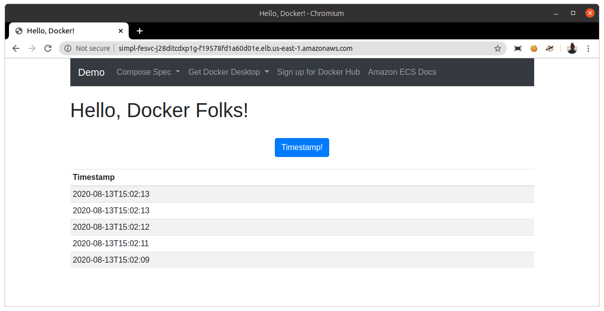

# Simple Frontend-Backend Application

>  
>  This CDK sample was inspired for the Jeff Bryner's blog post about [Taking AWS CDK for a spin for deploying docker containers](https://blog.jeffbryner.com/2020/07/20/aws-cdk-docker-explorations.html).  
>  Jeff used AWS CDK with Python, but in this sample I'm going to use TypeScript, that is only difference.
>  

__Type:__   
- TypeScript
- ECS: 2 containers (frontend in Python Flask, backend based on Redis to persist data)
- Fargate
- ALB
- [AWS Cloud Map](https://aws.amazon.com/cloud-map) (service discovery in VPC)

__Architecture:__


## 1. Steps

### 1.1. Initialize the CDK project

```sh
$ mkdir simple-frontend-backend-ecs && cd simple-frontend-backend-ecs
$ cdk init --language=typescript
```

The `cdk init` will generate an empty TypeScript project:


### 1.2. Write your code

Import modules to your project.
```sh
$ npm install @aws-cdk/core \
              @aws-cdk/aws-ec2 \
              @aws-cdk/aws-ecs \
              @aws-cdk/aws-ecs-patterns \
              @aws-cdk/aws-logs \
              @aws-cdk/aws-elasticloadbalancingv2 \
              @aws-cdk/aws-ecr \
              @aws-cdk/aws-ecr-assets
``` 

Implement your infrastructure writting the code below:
```sh
$ nano simple-frontend-backend-ecs/lib/simple-frontend-backend-ecs-stack.ts
``` 

### 1.3. Check the generated CloudFormation script

```sh
$ cdk synth
```

### 1.4. Deploy in you AWS account

If your project is going to use Docker to build its own Docker images, then you will need to install Docker in your local computer.
If you have not installed it, then you will have this error when trying execute `cdk deploy`:  
```sh
...
...
[0%] start: Publishing a0e03e994b7d88ba9c688c24b33ee785b12e591b4188fdfd1acddb8865270899:current
[100%] fail: write EPIPE

 ❌  SimpleFrontendBackendEcsStack failed: Error: Failed to publish one or more assets. See the error messages above for more information.
Error: spawn docker ENOENT
    at Process.ChildProcess._handle.onexit (internal/child_process.js:240:19)
    at onErrorNT (internal/child_process.js:415:16)
    at process._tickCallback (internal/process/next_tick.js:63:19)
``` 

Then, let's install Docker:
```sh
$ sudo apt install -y docker.io
$ sudo systemctl enable --now docker
$ sudo apt-mark hold docker.io
$ sudo usermod -aG docker $USER

// check the installation
$ docker --version
Docker version 19.03.8, build afacb8b7f0

$ sudo docker container run hello-world

// cleanning installation
$ sudo docker container stop $(docker container ls -aq)
$ sudo docker system prune -a --volumes

// you can now uninstall Docker as any other package installed with apt
$ sudo apt purge docker.io
$ sudo apt autoremove
```

Once Docker has been installed, you have to restart your computer, else you are going to have this error when running this `cdk deploy`:
```sh
...
...
[0%] start: Publishing a0e03e994b7d88ba9c688c24b33ee785b12e591b4188fdfd1acddb8865270899:current
[100%] fail: docker login --username AWS --password-stdin https://263455585760.dkr.ecr.us-east-1.amazonaws.com exited with error code 1: Got permission denied while trying to connect to the Docker daemon socket at unix:///var/run/docker.sock: Post http://%2Fvar%2Frun%2Fdocker.sock/v1.40/auth: dial unix /var/run/docker.sock: connect: permission denied

 ❌  SimpleFrontendBackendEcsStack failed: Error: Failed to publish one or more assets. See the error messages above for more information.
Failed to publish one or more assets. See the error messages above for more information.
``` 

Finally, you will be able to deploy your infrastructure:
```sh
$ cdk deploy
``` 


### 1.5. Calling the app

```sh
$ curl -v -o /dev/null -s http://simpl-albfa-1n9g163hy1164-42467199.us-east-1.elb.amazonaws.com
``` 

Or open above URL in your browser, you should see this:


### 1.6. Cleaning up

```sh
$ cdk destroy
``` 
